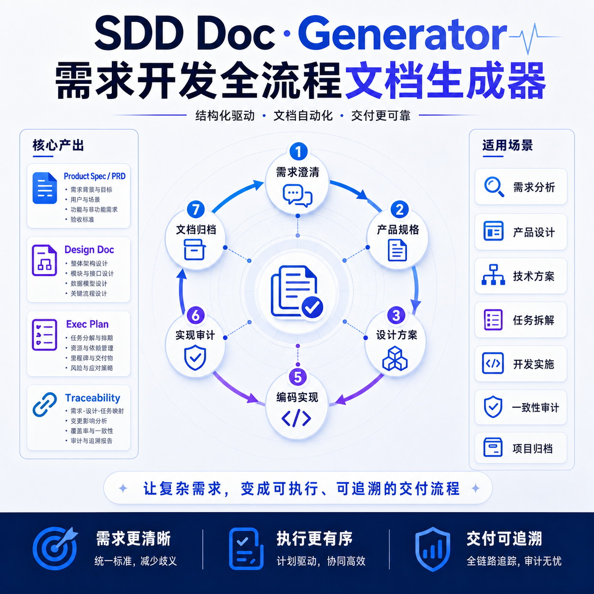
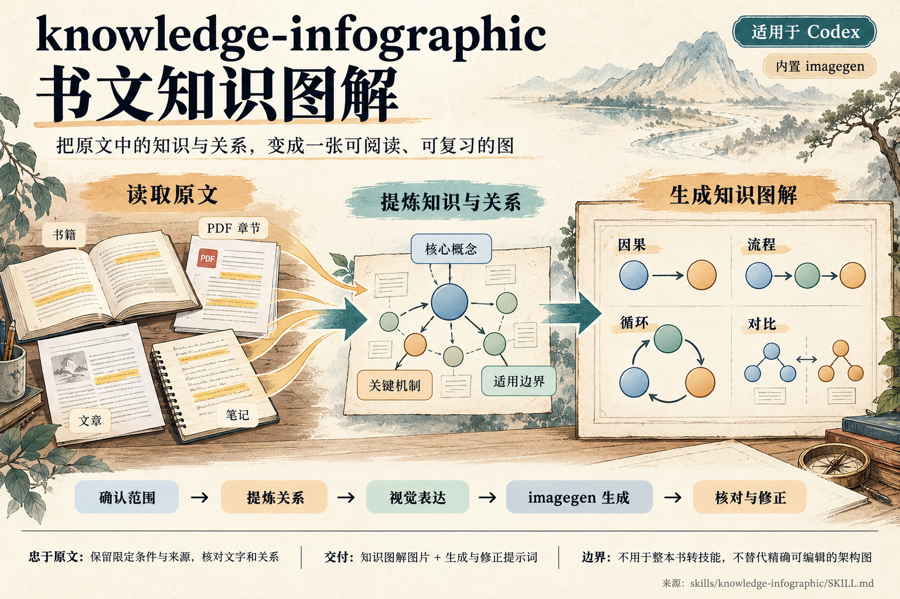

# 🧠 Skills Collection

---

## 安装

使用 [`skills`](https://github.com/vercel-labs/skills) CLI 从本仓库安装 skill。CLI 要求 **Node.js >= 22.20.0**。可用 `node -v` 检查版本。运行以下命令后，按提示选择安装范围和目标 Agent：

```bash
npx skills add dingw530/skills
```

也可以只安装指定 skill：

```bash
npx skills add dingw530/skills --skill product-pulse
npx skills add dingw530/skills --skill sdd-doc-generator
npx skills add dingw530/skills --skill knowledge-infographic
```

---

## Skill 清单

| Skill | 用途 | 说明 |
|---|---|---|
| [`product-pulse`](skills/product-pulse/SKILL.md) | AI 产品诊断与评估 | 从发心、用户、能力边界、反馈系统等七个维度评估产品，输出评分卡、风险预警和改进建议。 |
| [`sdd-doc-generator`](skills/sdd-doc-generator/SKILL.md) | 需求开发流程与文档生成 | 按 `spec`、`design`、`plan`、`apply`、`verify`、`check-doc`、`archive` 阶段推进需求开发。 |
| [`knowledge-infographic`](skills/knowledge-infographic/SKILL.md) | 书文知识图解（适用于 Codex） | 从书籍、PDF 指定章节、文章或笔记提炼核心知识及关系，使用 imagegen 生成文字清晰的知识图解。 |

---

## Product Pulse — AI 产品七维脉搏诊断框架

对 AI 产品/项目进行结构化深度评估，涵盖七个维度，输出定量评分卡 + 定性红灯预警 + 竞品对比。


**触发场景**：产品评估、项目复盘、产品诊断、自检清单、AI 产品分析、竞品对比、产品定位分析

| # | 维度 | 核心常数 |
|---|------|---------|
| ① | **发心** — 好产品只有一个主发心 | 产品的所有摇摆，根因都是发心不纯 |
| ② | **常与变** — 知道什么不变更重要 | 最典型的"敏捷变成奔波而非学习" |
| ③ | **演示友好 vs 日常友好** | 演示效果越好，越要警惕日常体验是否被牺牲 |
| ④ | **能力边界** — 知道不做什么更重要 | 没有边界 = 没有判断标准 |
| ⑤ | **用户分层** — 老板是最危险的用户 | CEO/创始人的痛点不等于大众痛点 |
| ⑥ | **反馈系统** — 听到的是真实声音还是回声 | 你听到的不是真实声音，而是过滤后的回声 |
| ⑦ | **团队与节奏** — 敏捷应该是学习而非奔波 | 每日一包文化 = 追逐变化而非坚守不变 |

**评分体系**：14 分制（每维度 2 分），等级评定 🟢 A 级（11-14） / 🟡 B 级（8-10） / 🔴 C 级（4-7） / ⛔ D 级（0-3）

**输出物**：逐维度评分及依据 → 🚨 红灯预警（P0/P1/P2）→ 📊 综合评分卡 → 关键教训与行动建议 → 多产品对比总表（可选）

---

> 📖 理论来源：基于《置身钉内》AI 产品开发全维复盘报告提炼得出

---

## SDD Doc Generator — 需求开发全流程文档生成器



围绕需求理解与澄清，逐步生成产品规格（PRD）、设计方案、执行计划，并支持编码实现、文档评审、实现审计与归档。

**触发场景**：PRD、产品规格、设计文档、技术方案、执行计划、开始开发、编码实现、实现审计、文档归档

**核心流程**：`spec` → `design` → `plan` → `apply` → `verify` → `check-doc` → `archive`

**调用方式**：`/sdd-doc-generator [阶段] [主题] [+补充约束]`

详见 [`skills/sdd-doc-generator/SKILL.md`](skills/sdd-doc-generator/SKILL.md)。

---

## Knowledge Infographic — 书文知识图解



**适用平台**：Codex（需要内置 imagegen 支持）。

将书籍、PDF 指定章节、文章或笔记转成可阅读、可复习的知识图解，使用 imagegen 生成位图，以图形表达因果、流程、循环、依赖和对比等关系。

**触发场景**：把指定章节画成一张图、文章知识可视化、笔记知识图解、补充或修正已有知识图解

**核心流程**：确认材料与范围 → 提炼知识与关系 → 设计视觉表达 → imagegen 生成 → 核对原文与文字 → 局部修正与交付

**输出物**：默认一张沿用材料主要语言的知识图解、图片文件及实际生成与修正提示词。

**使用示例**：

```text
使用 $knowledge-infographic 把这本 PDF 的 2.1–2.3 画成一张中文知识图，带工具循环和缓存示意。
把这篇文章生成一张知识图解，重点表现观点之间的因果关系。
```

**适用边界**：需要内置 imagegen 支持；不用于把整本书转换成知识库技能，也不替代精确可编辑的 SVG、draw.io 或代码架构图。

详见 [`skills/knowledge-infographic/SKILL.md`](skills/knowledge-infographic/SKILL.md)。
