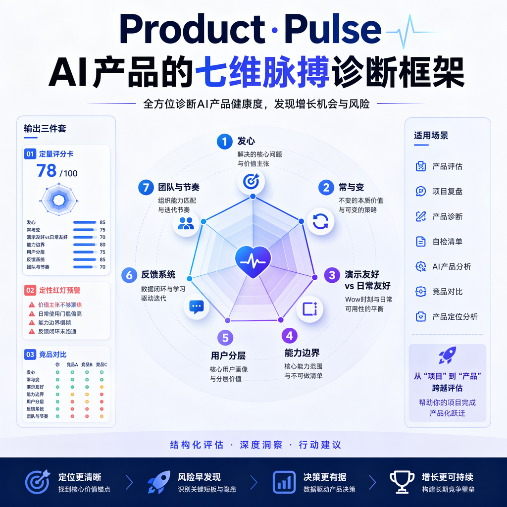

# 🧠 Skills Collection

---

## Product Pulse — AI 产品七维脉搏诊断框架

对 AI 产品/项目进行结构化深度评估，涵盖七个维度，输出定量评分卡 + 定性红灯预警 + 竞品对比。

**触发场景**：产品评估、项目复盘、产品诊断、自检清单、AI 产品分析、竞品对比、产品定位分析

| # | 维度 | 核心常数 |
|---|------|---------|
| ① | **发心** — 好产品只有一个主发心 | 产品的所有摇摆，根因都是发心不纯 |
| ② | **常与变** — 知道什么不变更重要 | 最典型的"敏捷变成奔波而非学习" |
| ③ | **演示友好 vs 日常友好** | 演示效果越好，越要警惕日常体验是否被牺牲 |
| ④ | **能力边界** — 知道不做什么更重要 | 没有边界 = 没有判断标准 |
| ⑤ | **用户分层** — 老板是最危险的用户 | CEO/创始人的痛点不等于大众痛点 |
| ⑥ | **反馈系统** — 听到的是真实声音还是回声 | 你听到的不是真实声音，而是过滤后的回声 |
| ⑦ | **团队与节奏** — 敏捷应该是学习而非奔波 | 每日一包文化 = 追逐变化而非坚守不变 |

**评分体系**：14 分制（每维度 2 分），等级评定 🟢 A 级（11-14） / 🟡 B 级（8-10） / 🔴 C 级（4-7） / ⛔ D 级（0-3）

**输出物**：逐维度评分及依据 → 🚨 红灯预警（P0/P1/P2）→ 📊 综合评分卡 → 关键教训与行动建议 → 多产品对比总表（可选）

---

> 📖 理论来源：基于《置身钉内》AI 产品开发全维复盘报告提炼得出

---

## SDD Doc Generator — 需求开发全流程文档生成器

围绕需求理解与澄清，逐步生成产品规格（PRD）、设计方案、执行计划，并支持编码实现、文档评审、实现审计与归档。

**触发场景**：PRD、产品规格、设计文档、技术方案、执行计划、开始开发、编码实现、实现审计、文档归档

**核心流程**：`spec` → `design` → `plan` → `apply` → `verify` → `check-doc` → `archive`

**调用方式**：`/sdd-doc-generator [阶段] [主题] [+补充约束]`

详见 [`skills/sdd-doc-generator/SKILL.md`](skills/sdd-doc-generator/SKILL.md)。
